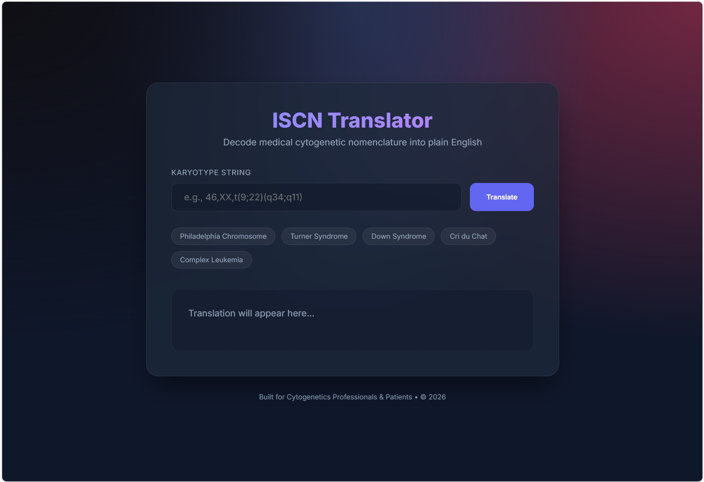

# ISCN Translator

A powerful, modern web application designed to translate complex International System for Human Cytogenetic Nomenclature (ISCN) strings into plain, easy-to-understand English.



## 🌟 Features

- **Robust Karyotype Parsing**: Decodes ISCN strings including sex chromosome determination and numerical/structural abnormalities.
- **Clinical Context**: Automatically identifies and provides information about associated cancer diseases (e.g., CML, AML, Lymphomas).
- **Smart Sex Identification**: Correctly identifies male/female status based on chromosome presence, including edge cases like `X,-Y` (male) or `X,-X` (female).
- **Premium UI**: Sleek, modern design using "Glassmorphism" aesthetics with dark mode support.
- **Interactive Examples**: Real-world examples (Philadelphia Chromosome, Down Syndrome, etc.) available for quick testing.

## 🚀 Getting Started

Simply open `index.html` in any modern web browser. No complex setup or installation is required—the app runs entirely on the frontend using Vanilla JavaScript and CSS.

### Using the App

1. Enter an ISCN string in the input field (e.g., `46,XX,t(9;22)(q34;q11)`).
2. Click **Translate** or press **Enter**.
3. View the detailed English breakdown and any clinical associations discovered.

## 🛠️ Tech Stack

- **HTML5**: Semantic structure.
- **CSS3 (Vanilla)**: Modern styling with glassmorphism, gradients, and custom properties.
- **JavaScript (ES6+)**: Custom parsing logic and UI interactions.

## 📁 Project Structure

```text
iscn-translator/
├── assets/
│   ├── css/
│   │   └── style.css      # Custom design system
│   └── js/
│       ├── translator.js # Core ISCN parsing logic
│       └── ui.js         # UI interaction handling
├── index.html            # Main entry point
└── README.md             # Project documentation
```

## ⚖️ Disclaimer

This tool is for educational and informational purposes only. It should not be used for clinical diagnosis. Always consult with a qualified medical professional or genetic counselor for the interpretation of medical results.
